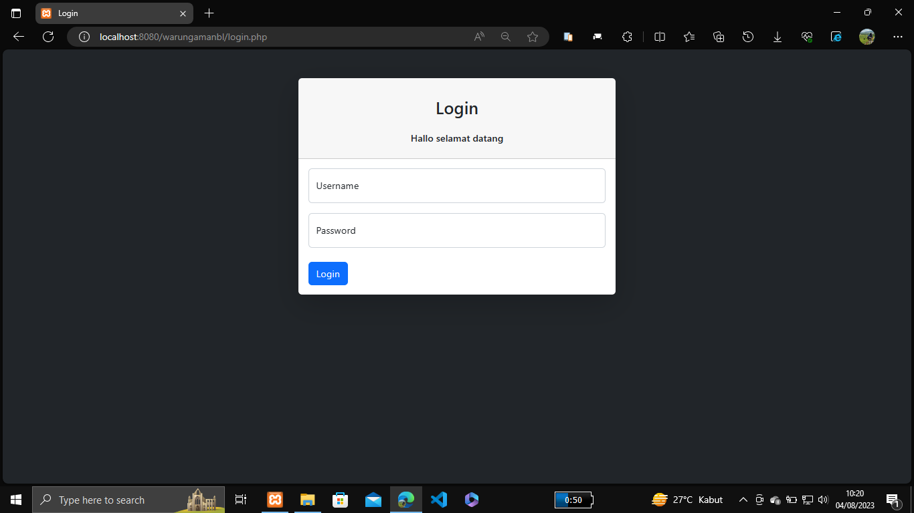
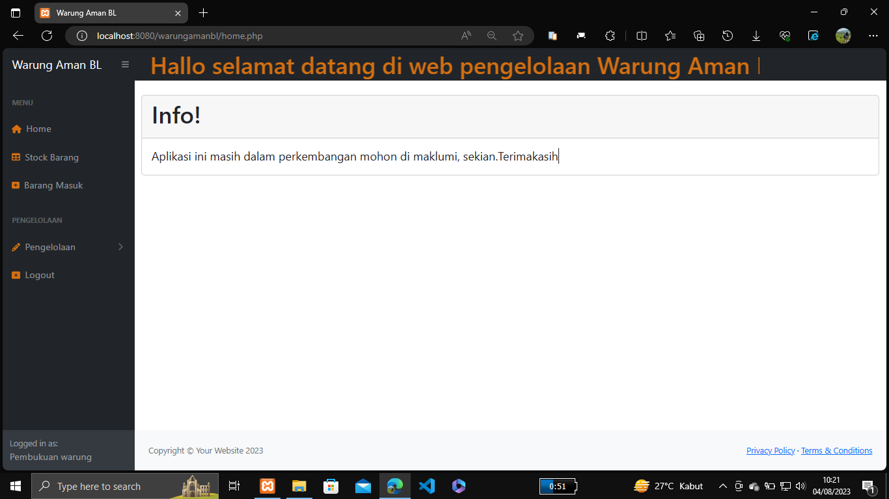
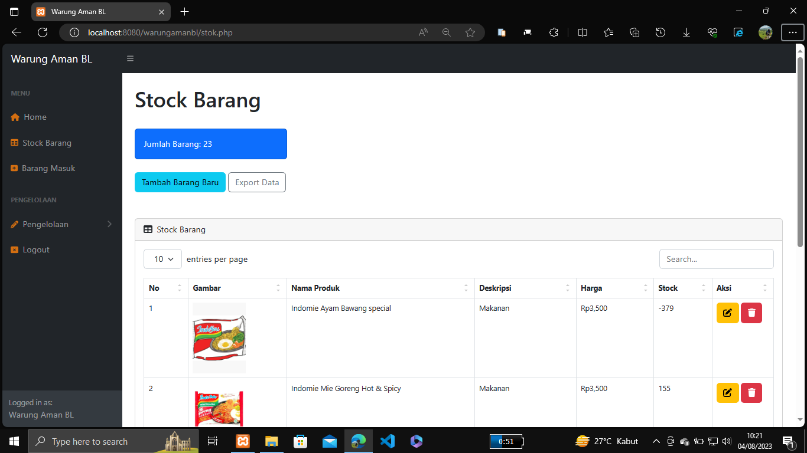
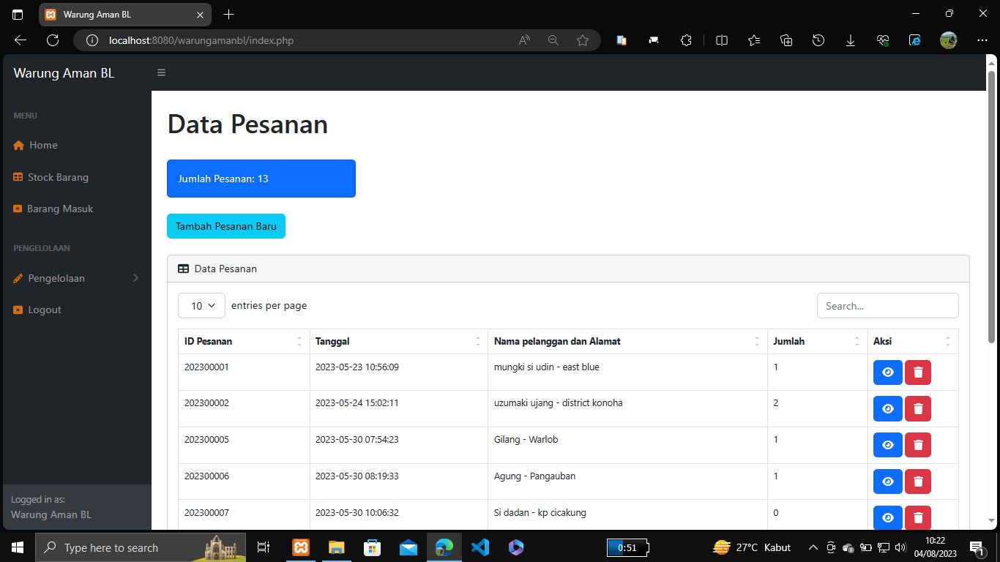
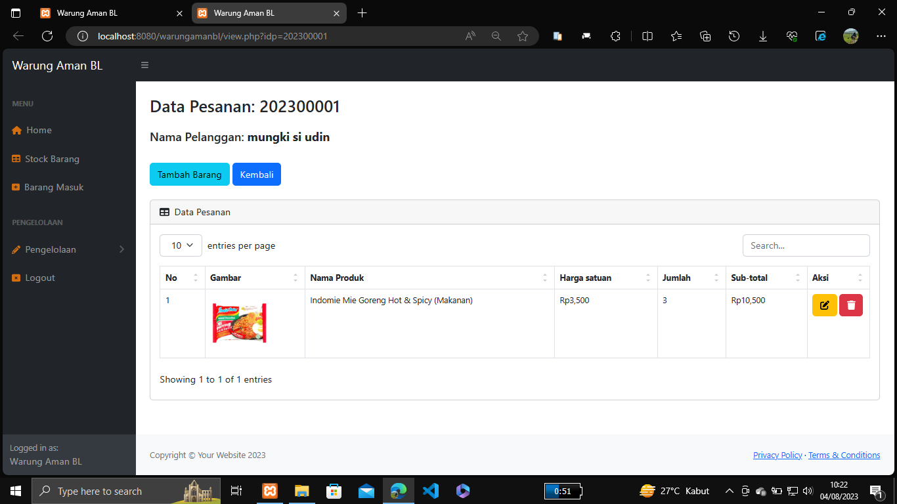
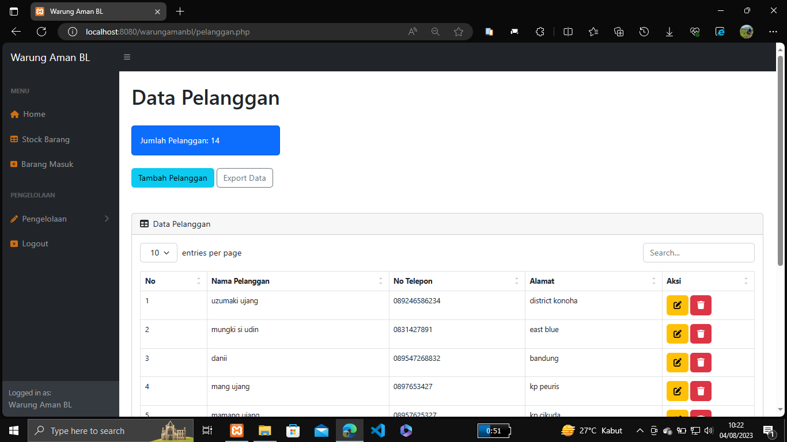

# Pengelolaan_Stock_Warung_Berbasis_Web

Aplikasi Inventory/Pengelolaan stock barang dengan PHP native, MySQLi dan Bootstrap 4. Aplikasi ini di buat general untuk bisa di aplikasikan ke berbagai barang / produk. contohnya yang saya buat ini adalah aplikasi bernama Warung Aman BL.

Tujuan di buat aplikasi ini untuk memudahkan admin/pengguna dalam mengecheck stock dan mempermudah dalam mengelola barang masuk, fitur fitur yang ada diaplikasi ini adalah:

1. Aplikasi ini baru memiliki 1 privilage yaitu admin,
2. Data stock barang,
3. Data barang masuk,
4. Pengelolaan pelanggan,
5. Pengelolaan data pesanan.

#### Untuk langkah-langkah menjalankan app ini baca di [Readme.txt](Readme.txt)

### Jangan Lupa bantu Follow
[My Instagram](https://www.instagram.com/ddan_i7/)

## Tampilan screenshot

[Tampilan Login](screenshot/login.png)

[Tampilan Home](screenshot/home.png)

[Tampilan Stock-barang](screenshot/stock-barang.png)

[Tampilan data-barang-masuk](screenshot/data-barang-masuk.png)

[Tampilan data-pesanan](screenshot/data-pesanan.png)

[Tampilan datails-pesanan](screenshot/details-data-pesanan.png)

[Tampilan data-pelanggan](screenshot/data-pelanggan.png)

