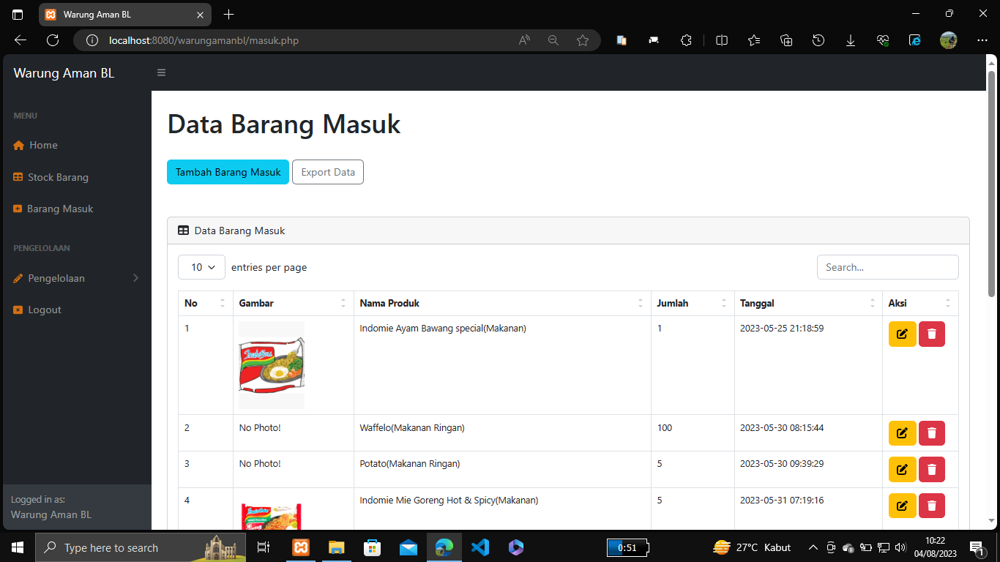

#Pengelolaan_Stock_Warung_Berbasis_Web

Aplikasi Inventory/Pengelolaan stock barang dengan PHP native, MySQLi dan Bootstrap 4. Aplikasi ini di buat general untuk bisa di aplikasikan ke berbagai barang / produk. contohnya yang saya buat ini adalah aplikasi bernama Warung Aman BL.

Tujuan di buat aplikasi ini untuk memudahkan admin/pengguna dalam mengecheck stock dan mempermudah dalam mengelola barang masuk, fitur fitur yang ada diaplikasi ini adalah:

1. Aplikasi ini baru memiliki 1 privilage yaitu admin,
2. Data stock barang,
3. Data barang masuk,
4. Pengelolaan pelanggan,
5. Pengelolaan data pesanan.

## Langkah 1: Kloning Repositori
Buka terminal/gitBash anda

git clone https://github.com/ddni7/Pengelolaan-warung.git

cd Pengelolaan-warung

